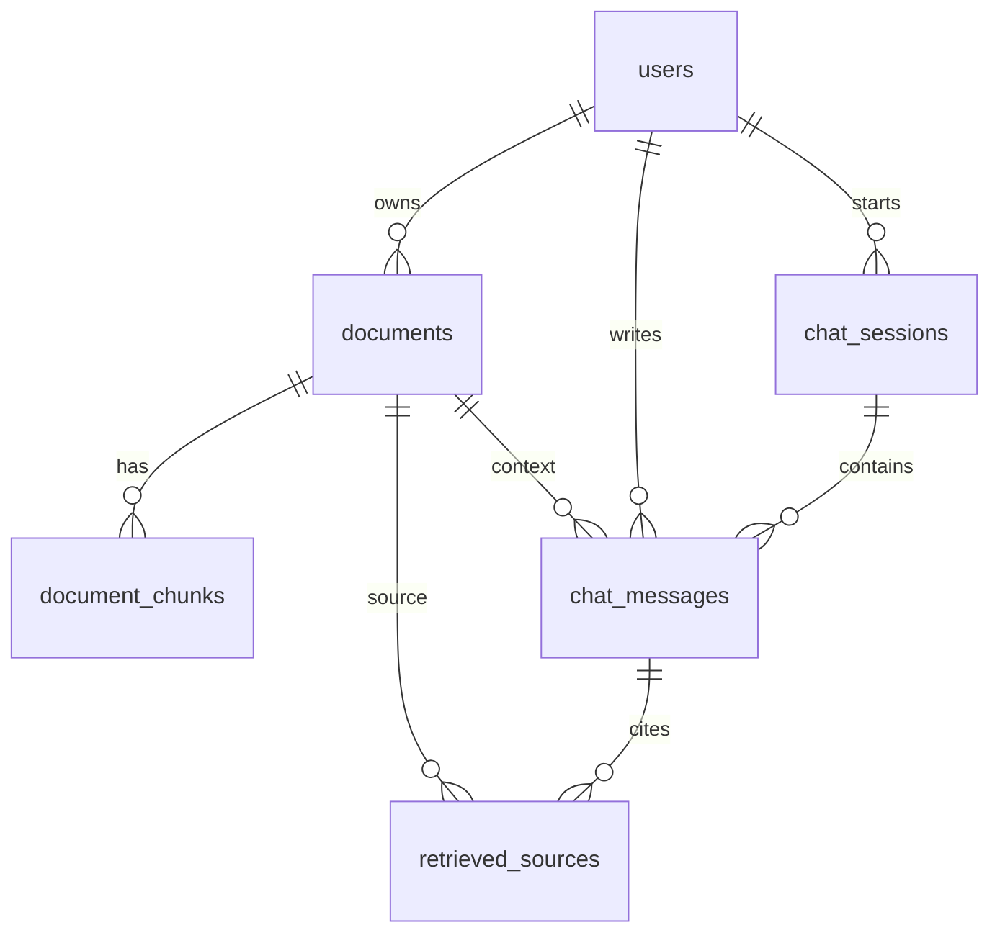

# Database Schema

기준 DB: `DLproject`  
DB 엔진/문자셋: MySQL 8.0, InnoDB, `utf8mb4_unicode_ci`  
스키마 원본: `mysql/schema.sql`  
확인일: 2026-05-26

## 개요

이 데이터베이스는 금융 문서 업로드, 파싱 결과, 문서 청크와 ChromaDB ID 매핑, 채팅 세션, 채팅 메시지, RAG 검색 근거를 저장한다.

임베딩 벡터 자체는 MySQL에 저장하지 않는다. 벡터와 검색용 청크 문서는 ChromaDB에 저장하고, MySQL은 문서 관리와 ChromaDB ID 추적만 담당한다.

| 테이블 | 목적 |
| --- | --- |
| `users` | 사용자 마스터 |
| `documents` | 업로드/파싱된 문서 메타데이터와 전체 페이지 수 |
| `document_chunks` | 문서 청크 번호, 페이지 번호, Chroma ID 매핑 |
| `chat_sessions` | 사용자별 채팅 세션 |
| `chat_messages` | 세션 내 사용자/assistant 메시지 |
| `retrieved_sources` | assistant 답변 생성 시 사용된 검색 근거 |

## MySQL과 ChromaDB 역할

| 데이터 | 저장 위치 |
| --- | --- |
| 문서 메타데이터 | MySQL `documents` |
| 청크 번호와 페이지 번호 | MySQL `document_chunks` |
| ChromaDB 벡터 ID | MySQL `document_chunks.chroma_id` |
| 청크 본문 | ChromaDB `documents`, MySQL에는 `text_preview`만 저장 |
| 임베딩 벡터 | ChromaDB |
| 검색용 metadata | ChromaDB metadata, 답변 근거는 MySQL `retrieved_sources.metadata` |

예:

```text
MySQL document_chunks
- document_id: d562...
- chunk_id: 1
- page_number: 1
- chroma_id: d562..._chunk1
- text_preview: 청크 앞부분 500자

ChromaDB
- id: d562..._chunk1
- document: 실제 청크 텍스트
- embedding: 벡터값
- metadata: document_id, chunk_id, page_number, company ...
```

## 관계 요약



## 테이블 상세

### `users`

사용자 식별자를 저장한다.

| 컬럼 | 타입 | Null | 기본값 | Key | 설명 |
| --- | --- | --- | --- | --- | --- |
| `user_id` | `varchar(64)` | NO |  | PK | 사용자 ID |
| `created_at` | `datetime` | NO | `CURRENT_TIMESTAMP` |  | 생성 시각 |
| `updated_at` | `datetime` | NO | `CURRENT_TIMESTAMP` |  | 수정 시각 |

Keys:
- PK: `users.user_id`

### `documents`

업로드된 문서의 원본 파일 경로, 파싱 결과 경로, 분류, 회사, 제목, 처리 상태를 저장한다.

| 컬럼 | 타입 | Null | 기본값 | Key | 설명 |
| --- | --- | --- | --- | --- | --- |
| `document_id` | `varchar(255)` | NO |  | PK | 문서 ID. 현재 파싱 결과의 `document_uuid`를 사용 |
| `user_id` | `varchar(64)` | NO |  | FK, IDX | 소유 사용자 ID |
| `original_filename` | `varchar(512)` | YES | `NULL` |  | 업로드 당시 원본 파일명 |
| `stored_path` | `text` | YES | `NULL` |  | 서버에 저장된 원본 파일 경로 |
| `txt_path` | `text` | YES | `NULL` |  | 추출 텍스트 파일 경로 |
| `json_path` | `text` | YES | `NULL` |  | 파싱 결과 JSON 경로 |
| `document_sector` | `varchar(64)` | YES | `NULL` |  | 문서 섹터, 예: `bank`, `card` |
| `document_date` | `varchar(32)` | YES | `NULL` |  | 문서 기준일 또는 처리일 |
| `document_type` | `varchar(255)` | YES | `NULL` | IDX | 문서 유형 |
| `company` | `varchar(255)` | YES | `NULL` | IDX | 금융사/회사명 |
| `document_title` | `text` | YES | `NULL` |  | 문서 제목 |
| `status` | `varchar(32)` | NO | `processed` |  | 처리 상태. 예: `parsed`, `chunked`, `embedded`, `failed` |
| `error_message` | `text` | YES | `NULL` |  | 처리 실패 메시지 |
| `chunk_count` | `int` | NO | `0` |  | 저장된 청크 수 |
| `page_count` | `int` | YES | `NULL` |  | 문서 전체 페이지 수 |
| `created_at` | `datetime` | NO | `CURRENT_TIMESTAMP` |  | 생성 시각 |
| `updated_at` | `datetime` | NO | `CURRENT_TIMESTAMP` |  | 수정 시각 |

Keys:
- PK: `documents.document_id`
- FK: `documents.user_id` -> `users.user_id`
- Index: `idx_documents_user_id(user_id)`
- Index: `idx_documents_company(company)`
- Index: `idx_documents_type(document_type)`

### `document_chunks`

문서별 청크 번호와 ChromaDB 벡터 ID를 매핑한다.

| 컬럼 | 타입 | Null | 기본값 | Key | 설명 |
| --- | --- | --- | --- | --- | --- |
| `id` | `bigint` | NO |  | PK | 내부 식별자 |
| `document_id` | `varchar(255)` | NO |  | FK, IDX, UQ | 문서 ID |
| `chunk_id` | `int` | NO |  | UQ | 문서 내 청크 번호 |
| `page_number` | `int` | YES | `NULL` |  | 청크가 시작되는 페이지 번호 |
| `chroma_id` | `varchar(512)` | NO |  |  | ChromaDB 저장 ID. 예: `{document_uuid}_chunk1` |
| `text_preview` | `text` | YES | `NULL` |  | 청크 내용 미리보기 |
| `created_at` | `datetime` | NO | `CURRENT_TIMESTAMP` |  | 생성 시각 |

Keys:
- PK: `document_chunks.id`
- Unique: `uq_document_chunk(document_id, chunk_id)`
- FK: `document_chunks.document_id` -> `documents.document_id`
- Index: `idx_document_chunks_document_id(document_id)`

### `chat_sessions`

사용자별 채팅 세션을 저장한다.

| 컬럼 | 타입 | Null | 기본값 | Key | 설명 |
| --- | --- | --- | --- | --- | --- |
| `session_id` | `varchar(64)` | NO |  | PK | 채팅 세션 ID |
| `user_id` | `varchar(64)` | NO |  | FK, IDX | 사용자 ID |
| `title` | `varchar(255)` | YES | `NULL` |  | 세션 제목 |
| `created_at` | `datetime` | NO | `CURRENT_TIMESTAMP` |  | 생성 시각 |
| `updated_at` | `datetime` | NO | `CURRENT_TIMESTAMP` |  | 수정 시각 |

Keys:
- PK: `chat_sessions.session_id`
- FK: `chat_sessions.user_id` -> `users.user_id`
- Index: `idx_chat_sessions_user_id(user_id)`

### `chat_messages`

채팅 세션 내 메시지를 저장한다. `document_id`는 특정 문서 컨텍스트가 있을 때 연결된다.

| 컬럼 | 타입 | Null | 기본값 | Key | 설명 |
| --- | --- | --- | --- | --- | --- |
| `message_id` | `bigint` | NO |  | PK | 메시지 ID |
| `session_id` | `varchar(64)` | NO |  | FK, IDX | 채팅 세션 ID |
| `user_id` | `varchar(64)` | NO |  | FK, IDX | 사용자 ID |
| `document_id` | `varchar(255)` | YES | `NULL` | FK, IDX | 관련 문서 ID |
| `role` | `varchar(32)` | NO |  |  | 메시지 역할. 예: `user`, `assistant` |
| `content` | `longtext` | NO |  |  | 메시지 본문 |
| `created_at` | `datetime` | NO | `CURRENT_TIMESTAMP` |  | 생성 시각 |

Keys:
- PK: `chat_messages.message_id`
- FK: `chat_messages.session_id` -> `chat_sessions.session_id`
- FK: `chat_messages.user_id` -> `users.user_id`
- FK: `chat_messages.document_id` -> `documents.document_id`
- Index: `idx_chat_messages_session_id(session_id)`
- Index: `idx_chat_messages_user_id(user_id)`
- Index: `idx_chat_messages_document_id(document_id)`

### `retrieved_sources`

assistant 답변 생성 시 검색된 문서 근거를 저장한다.

| 컬럼 | 타입 | Null | 기본값 | Key | 설명 |
| --- | --- | --- | --- | --- | --- |
| `id` | `bigint` | NO |  | PK | 내부 식별자 |
| `message_id` | `bigint` | NO |  | FK, IDX | 근거가 연결된 assistant 메시지 ID |
| `document_id` | `varchar(255)` | YES | `NULL` | FK, IDX | 검색 근거 문서 ID |
| `chunk_id` | `int` | YES | `NULL` |  | 검색 근거 청크 번호 |
| `page_number` | `int` | YES | `NULL` |  | 검색 근거 페이지 번호 |
| `distance` | `double` | YES | `NULL` |  | 벡터 검색 거리 또는 유사도 점수 |
| `metadata` | `json` | YES | `NULL` |  | 검색 결과 메타데이터 |
| `created_at` | `datetime` | NO | `CURRENT_TIMESTAMP` |  | 생성 시각 |

Keys:
- PK: `retrieved_sources.id`
- FK: `retrieved_sources.message_id` -> `chat_messages.message_id`
- FK: `retrieved_sources.document_id` -> `documents.document_id`
- Index: `idx_retrieved_sources_message_id(message_id)`
- Index: `idx_retrieved_sources_document_id(document_id)`

## 청킹/임베딩 파이프라인 매핑

1. `src/rag/chunking.py`
   - 파싱 JSON을 읽어 청크 목록을 만든다.
   - 청킹 결과를 `data/processed/chunking/*_chunked.json`에 저장한다.
   - MySQL이 활성화되어 있으면 `documents`와 `document_chunks`에 문서/청크 매핑만 저장한다.

2. `src/rag/fixed_embedder.py`
   - `data/processed/chunking`의 청크 JSON을 읽는다.
   - Vertex AI로 임베딩을 생성한다.
   - ChromaDB `financial_documents` 컬렉션에 `id`, `embedding`, `document`, `metadata`를 저장한다.
   - MySQL이 활성화되어 있으면 `document_chunks.chroma_id`를 ChromaDB ID로 맞추고 `documents.status`를 `embedded`로 갱신한다.

## FK 목록

| 제약조건 | 테이블.컬럼 | 참조 테이블.컬럼 |
| --- | --- | --- |
| `fk_documents_user` | `documents.user_id` | `users.user_id` |
| `fk_document_chunks_document` | `document_chunks.document_id` | `documents.document_id` |
| `fk_chat_sessions_user` | `chat_sessions.user_id` | `users.user_id` |
| `fk_chat_messages_session` | `chat_messages.session_id` | `chat_sessions.session_id` |
| `fk_chat_messages_user` | `chat_messages.user_id` | `users.user_id` |
| `fk_chat_messages_document` | `chat_messages.document_id` | `documents.document_id` |
| `fk_retrieved_sources_message` | `retrieved_sources.message_id` | `chat_messages.message_id` |
| `fk_retrieved_sources_document` | `retrieved_sources.document_id` | `documents.document_id` |

## 인덱스 목록

| 테이블 | 인덱스 | Unique | 컬럼 |
| --- | --- | --- | --- |
| `users` | `PRIMARY` | YES | `user_id` |
| `documents` | `PRIMARY` | YES | `document_id` |
| `documents` | `idx_documents_user_id` | NO | `user_id` |
| `documents` | `idx_documents_company` | NO | `company` |
| `documents` | `idx_documents_type` | NO | `document_type` |
| `document_chunks` | `PRIMARY` | YES | `id` |
| `document_chunks` | `uq_document_chunk` | YES | `document_id`, `chunk_id` |
| `document_chunks` | `idx_document_chunks_document_id` | NO | `document_id` |
| `chat_sessions` | `PRIMARY` | YES | `session_id` |
| `chat_sessions` | `idx_chat_sessions_user_id` | NO | `user_id` |
| `chat_messages` | `PRIMARY` | YES | `message_id` |
| `chat_messages` | `idx_chat_messages_session_id` | NO | `session_id` |
| `chat_messages` | `idx_chat_messages_user_id` | NO | `user_id` |
| `chat_messages` | `idx_chat_messages_document_id` | NO | `document_id` |
| `retrieved_sources` | `PRIMARY` | YES | `id` |
| `retrieved_sources` | `idx_retrieved_sources_message_id` | NO | `message_id` |
| `retrieved_sources` | `idx_retrieved_sources_document_id` | NO | `document_id` |

## 삭제/갱신 동작

현재 FK에는 `ON DELETE` / `ON UPDATE` 옵션이 명시되어 있지 않다. MySQL 기본 동작에 따라 참조 중인 부모 행 삭제/키 변경은 제한된다.

웹 API `DELETE /api/documents/{document_id}`는 FK 제약을 피하기 위해 아래 순서로 삭제/정리한다.

1. `retrieved_sources`에서 해당 `document_id` 근거 삭제
2. `chat_messages.document_id`를 `NULL`로 변경해서 기존 채팅 내용은 보존
3. `document_chunks` 삭제
4. `documents` 삭제

기본 동작은 MySQL 문서 메타/청크, Chroma vector, 업로드 원본/JSON/TXT 파일을 함께 삭제한다. 파일 삭제는 허용된 데이터 폴더 안의 경로만 대상으로 한다.
